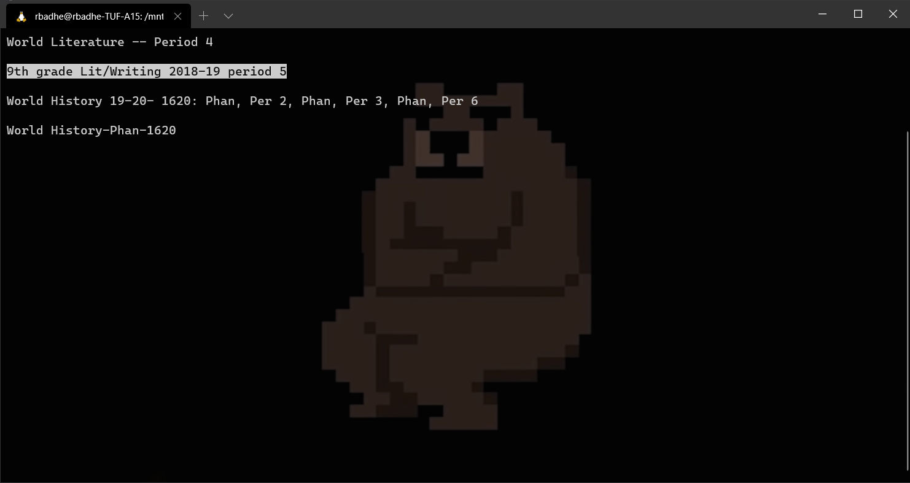
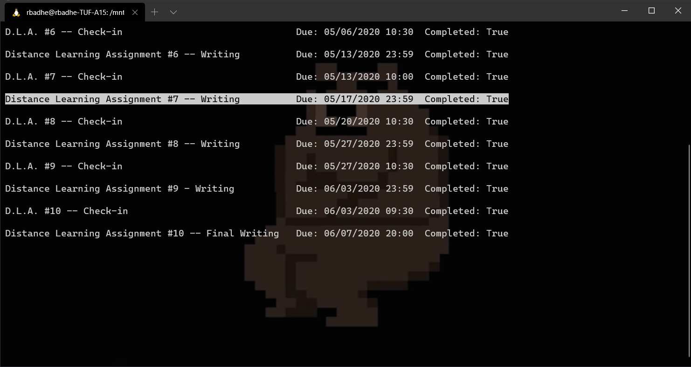
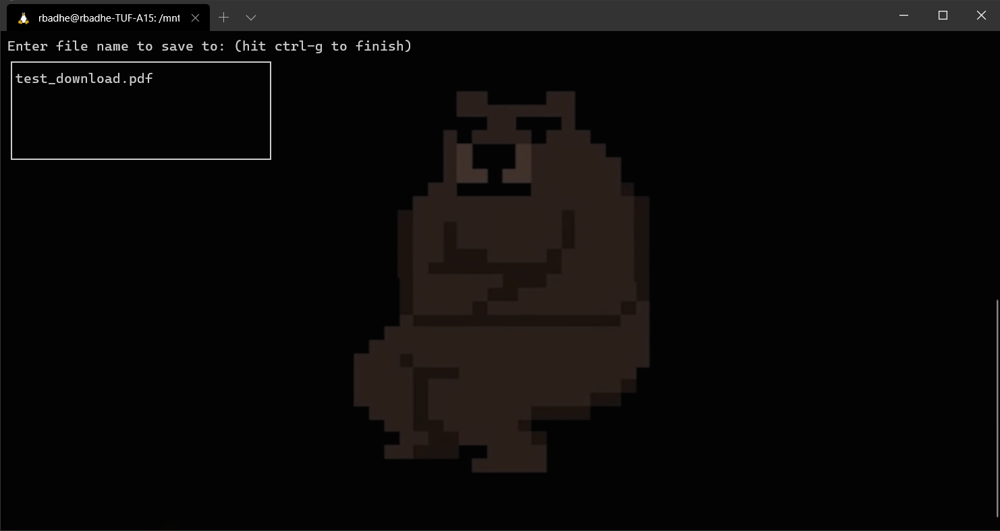
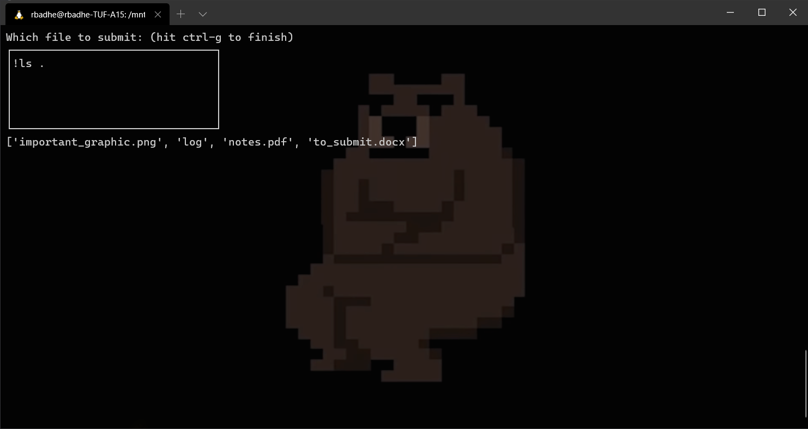

# Turnitin-CLI

A commandline interface to https://www.turnitin.com

# Usage

``python -m turnitin_cli``

# Screenshots

## Courses

## Assignments

## Downloading an Assignment

## Submitting an Assignment

# Setup

``pip install turnitin-cli``

Default keybindings:

| Key   | Function  |
| ----- | --------- |
| ``,`` | Menu down |
| ``.`` | Menu up   |
| ``q`` | Quit      |

These keybindings can be changed in the configuration file located at ``$HOME/tiiconfig.ini``.
While submitting, one can type ``!ls {{folder}}`` to list the contents of the folder.

Features to implement:
 * A backwards button for history
 * Displaying submission metadata
 * Adding default filenames for downloads
 * Adding a file browser

